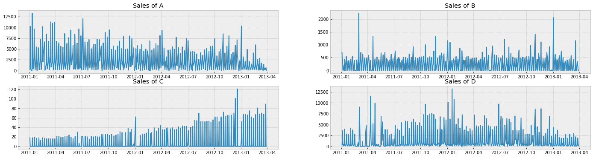
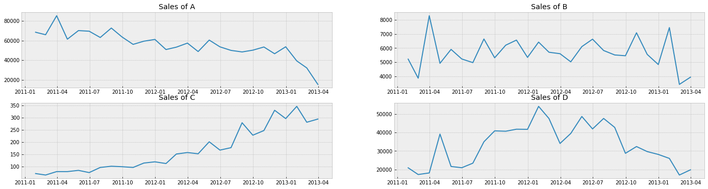
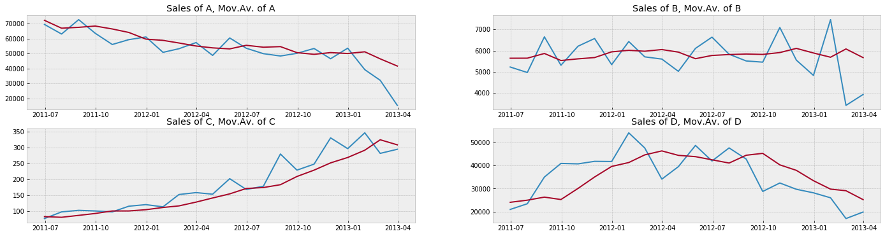

# Prepare data

### Downloading and reading data

<table border="1" class="dataframe">
  <thead>
    <tr style="text-align: right;">
      <th></th>
      <th>Sales of A</th>
      <th>Sales of B</th>
      <th>Sales of C</th>
      <th>Sales of D</th>
    </tr>
    <tr>
      <th>Date</th>
      <th></th>
      <th></th>
      <th></th>
      <th></th>
    </tr>
  </thead>
  <tbody>
    <tr>
      <th>2011-01-03</th>
      <td>210.0</td>
      <td>702.0</td>
      <td>18.0</td>
      <td>516.0</td>
    </tr>
    <tr>
      <th>2011-01-04</th>
      <td>10294.0</td>
      <td>402.0</td>
      <td>0.0</td>
      <td>324.0</td>
    </tr>
    <tr>
      <th>2011-01-05</th>
      <td>3395.0</td>
      <td>438.0</td>
      <td>0.0</td>
      <td>3618.0</td>
    </tr>
    <tr>
      <th>2011-01-06</th>
      <td>432.0</td>
      <td>19.0</td>
      <td>0.0</td>
      <td>414.0</td>
    </tr>
    <tr>
      <th>2011-01-07</th>
      <td>106.0</td>
      <td>0.0</td>
      <td>0.0</td>
      <td>72.0</td>
    </tr>
  </tbody>
</table>

### Visualising data

 

Probably we should aggregate data by month too gain more insights

# Define appropriate forecasting method

Let's try to approximate our sales timeseries with following methods:

1.   Moving average
2.   Exponential Smoothing

## Moving average

Defining function for moving average

Finding optimal value for number of periods using MSE as main metriics

<table border="1" class="dataframe">
  <thead>
    <tr style="text-align: right;">
      <th></th>
      <th>col</th>
      <th>N</th>
      <th>me</th>
      <th>mape</th>
      <th>mse</th>
    </tr>
  </thead>
  <tbody>
    <tr>
      <th>2</th>
      <td>Sales of A</td>
      <td>3</td>
      <td>-3030.36</td>
      <td>0.099006</td>
      <td>38546864.60</td>
    </tr>
    <tr>
      <th>4</th>
      <td>Sales of B</td>
      <td>5</td>
      <td>-59.68</td>
      <td>0.117352</td>
      <td>734718.48</td>
    </tr>
    <tr>
      <th>8</th>
      <td>Sales of C</td>
      <td>3</td>
      <td>18.56</td>
      <td>0.117841</td>
      <td>1121.04</td>
    </tr>
    <tr>
      <th>9</th>
      <td>Sales of D</td>
      <td>4</td>
      <td>-343.52</td>
      <td>0.184209</td>
      <td>59802987.04</td>
    </tr>
  </tbody>
</table>

Calculating Moving Average with N calculated above

We can find that moving average with optimal N parameter overall cathes trend but lack reactions on the fluctuations of demand

## Exponential Smoothing

Optimal alpha and Exponential Smoothing Results

<table border="1" class="dataframe">
  <thead>
    <tr style="text-align: right;">
      <th></th>
      <th>col</th>
      <th>alpha</th>
      <th>me</th>
      <th>mape</th>
      <th>mse</th>
    </tr>
  </thead>
  <tbody>
    <tr>
      <th>2</th>
      <td>Sales of A</td>
      <td>0.4</td>
      <td>-2768.88</td>
      <td>0.113479</td>
      <td>56971264.56</td>
    </tr>
    <tr>
      <th>4</th>
      <td>Sales of B</td>
      <td>0.1</td>
      <td>173.00</td>
      <td>0.145711</td>
      <td>1241678.52</td>
    </tr>
    <tr>
      <th>8</th>
      <td>Sales of C</td>
      <td>0.7</td>
      <td>12.84</td>
      <td>0.116684</td>
      <td>1176.20</td>
    </tr>
    <tr>
      <th>11</th>
      <td>Sales of D</td>
      <td>0.6</td>
      <td>16.32</td>
      <td>0.195464</td>
      <td>67237450.00</td>
    </tr>
  </tbody>
</table>

Optimal N periods and Moving Averave Forecast Results

<table border="1" class="dataframe">
  <thead>
    <tr style="text-align: right;">
      <th></th>
      <th>col</th>
      <th>N</th>
      <th>me</th>
      <th>mape</th>
      <th>mse</th>
    </tr>
  </thead>
  <tbody>
    <tr>
      <th>2</th>
      <td>Sales of A</td>
      <td>3</td>
      <td>-3030.36</td>
      <td>0.099006</td>
      <td>38546864.60</td>
    </tr>
    <tr>
      <th>4</th>
      <td>Sales of B</td>
      <td>5</td>
      <td>-59.68</td>
      <td>0.117352</td>
      <td>734718.48</td>
    </tr>
    <tr>
      <th>8</th>
      <td>Sales of C</td>
      <td>3</td>
      <td>18.56</td>
      <td>0.117841</td>
      <td>1121.04</td>
    </tr>
    <tr>
      <th>9</th>
      <td>Sales of D</td>
      <td>4</td>
      <td>-343.52</td>
      <td>0.184209</td>
      <td>59802987.04</td>
    </tr>
  </tbody>
</table>

We can find here that the results of exponential smoothing is worse than moving average if using MSE metrics for all products except C, which results is very similar.

So on current data is better to use moving average.

